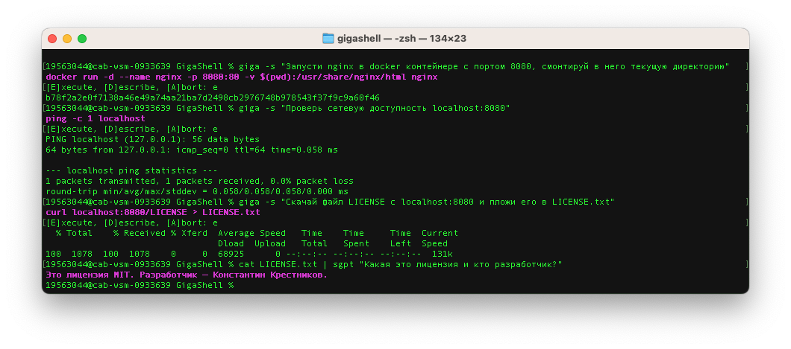

# GigaShell

Версия библиотеки [ShellGPT](https://github.com/TheR1D/shell_gpt), доработанная для работы с русским языком и [нейросетевой моделью GigaChat](https://developers.sber.ru/portal/products/gigachat).

GigaShell — кроссплатформенная утилита, которая позволяет обращаться к большим языковым моделям (LLM) из командной строки. Используйте GigaShell для создания команд оболочки, фрагментов кода, комментариев и документации, а так же решения других задач. Утилита поддерживает все основные операционные системы, включая Linux, macOS и Windows, а также различные оболочки, среди которых PowerShell, CMD, Bash, Zsh, Fish и многие другие.



## Установка

GigaShell можно установить с помощью pip:

```shell
pip install gigashell
```

Для работы вам понадобятся данные для [авторизации запросов к GigaChat API](https://developers.sber.ru/docs/ru/gigachat/api/authorization).

## Использование

К различным сценариям использования GigaShell можно отнести запросы, генерирование команд оболочки или фрагментов кода, и другие задачи.

Для вызова GigaShell используйте команду `giga`.

### Запросы

Утилиту можно использовать вместо поисковой машины:

```shell
giga "nginx default config file location"
# -> The default configuration file for Nginx is located at /etc/nginx/nginx.conf.
```

```shell
giga "mass of sun"
# -> = 1.99 × 10^30 kg
```

```shell
giga "1 hour and 30 minutes to seconds"
# -> 5,400 seconds
```

### Анализ и суммаризация

Вы можете передавать промпты на вход в GigaShell как в виде аргументов команды, так и в виде стандартного ввода (*stdin*). Разнообразие способов ввода полезна если в LLM надо передать содержимое файла или вывод других команд. Такая функциональность упрощает обработку данных из различных источников и позволяет сфокусироваться на главном.

Например, так вы можете генерировать сообщения для коммитов на основе сделанных изменений:

```shell
git diff | giga "Generate git commit message, for my changes"
# -> Commit message: Implement Model enum and get_edited_prompt()
```

Вы можете анализировать различные логи, передавая их в виде аргументов или стандартного ввода совместно с понятным промптом. Таким образом вы сможете быстро выделять ошибки и узнавать о способах их исправления:

```shell
docker logs -n 20 container_name | giga "check logs, find errors, provide possible solutions"
# ...
```

### Команды оболочки

Опция `--shell`, сокращенно `--s`, позволяет находить и выполнять частоиспользуемые команды вроде `chmod` с помощью промптов в командной строке:

```shell
giga --shell "make all files in current directory read only"
# -> chmod 444 *
# -> [E]xecute, [D]escribe, [A]bort: e
...
```

GigaShell автоматически определяет вашу операционную систему и оболочку (`$SHELL`), и вызывает подходящую команду. Так, если вы обратитесь к `giga` с командой обновить систему, утилита вызовет соответствующую ОС команду. Пример для macOS:

```shell
giga -s "update my system"
# -> sudo softwareupdate -i -a
# -> [E]xecute, [D]escribe, [A]bort: e
...
```

Тот же промпт, использованный в Ubuntu, даст другой результат:

```shell
giga -s "update my system"
# -> sudo apt update && sudo apt upgrade -y
# -> [E]xecute, [D]escribe, [A]bort: e
...
```

Вы можете попросить LLM предоставить краткое описание команды:

```shell
giga -s "show all txt files in current folder"
# -> ls *.txt
# -> [E]xecute, [D]escribe, [A]bort: d
# -> List all files with .txt extension in current directory
# -> [E]xecute, [D]escribe, [A]bort: e
...
```

Пример работы с docker-контейнерами: 

```shell
giga -s "start nginx using docker, forward 443 and 80 port, mount current folder with index.html"
# -> docker run -d -p 443:443 -p 80:80 -v $(pwd):/usr/share/nginx/html nginx
# -> [E]xecute, [D]escribe, [A]bort: e
...
```

Вы можете вызывать команды оболочки с использованные данных, переданных на вход в `giga`:

```shell
cat data.json | giga -s "curl localhost with provided json"
# -> curl -X POST -H "Content-Type: application/json" -d '{"a": 1, "b": 2, "c": 3}' http://localhost
```

Кроме того возможно и более находчивое использование оболочки. Например, вы можете передать имена файлов в ffmpeg:

```shell
ls
# -> 1.mp4 2.mp4 3.mp4
giga -s "using ffmpeg combine multiple videos into one without audio. Video file names: $(ls -m)"
# -> ffmpeg -i 1.mp4 -i 2.mp4 -i 3.mp4 -filter_complex "[0:v] [1:v] [2:v] concat=n=3:v=1 [v]" -map "[v]" out.mp4
# -> [E]xecute, [D]escribe, [A]bort: e
...
```

### Встраивание в оболочку

> [!NOTE]
> Функциональность доступна только в bash и zsh.

Встраивание в оболочку позволяет вызывать GigaShell в командной строке с помощью горячих клавиш. Встраивание позволяет получить предложения `giga` в истории команд оболочки, наряду с возможностью редактирования команд на лету.

https://github.com/TheR1D/shell_gpt/assets/16740832/bead0dab-0dd9-436d-88b7-6abfb2c556c1

Чтобы встроить `giga` в оболочку, выполните команду:

```shell
giga --install-integration
# Restart your terminal to apply changes.
```

Команда модифицирует конфигурационный файл вашей оболочки: `.bashrc` или `.zshrc`. После чего вы сможете вызвать GigaShell с помощью сочетания клавиш CTRL+L (по умолчанию). При нажатии клавиш утилита возьмет из буфера введенную строку и заменит ее на предложенную команду. Вы можете изменить команду и выполнить ее, нажав ENTER.

### Генерирование кода

Используйте опцию `--code`, чтобы получить код в результате работы команды:

```shell
giga --code "Solve classic fizz buzz problem using Python"
```

```python
for i in range(1, 101):
    if i % 3 == 0 and i % 5 == 0:
        print("FizzBuzz")
    elif i % 3 == 0:
        print("Fizz")
    elif i % 5 == 0:
        print("Buzz")
    else:
        print(i)
```

На выходе получается валидный код на Python, который можно записать в файл:

```shell
giga --code "solve classic fizz buzz problem using Python" > fizz_buzz.py
python fizz_buzz.py
# 1
# 2
# Fizz
# 4
# Buzz
# Fizz
# ...
```

Вы также можете передавать данные на вход в `giga`:

```shell
cat fizz_buzz.py | giga --code "Generate comments for each line of my code"
```

```python
# Loop through numbers 1 to 100
for i in range(1, 101):
    # Check if number is divisible by both 3 and 5
    if i % 3 == 0 and i % 5 == 0:
        # Print "FizzBuzz" if number is divisible by both 3 and 5
        print("FizzBuzz")
    # Check if number is divisible by 3
    elif i % 3 == 0:
        # Print "Fizz" if number is divisible by 3
        print("Fizz")
    # Check if number is divisible by 5
    elif i % 5 == 0:
        # Print "Buzz" if number is divisible by 5
        print("Buzz")
    # If number is not divisible by 3 or 5, print the number itself
    else:
        print(i)
```

### Режимы разговора с моделью Conversational Modes - Overview

GigaShell сохраняет и позволяет восстановить все разговоры с моделью

GigaShell может работать как с единичными запросами к модели (режим чата) так и в режиме интерактивного обмена сообщениями с моделью (режим REPL). Независимо от выбранного режима утилита сохраняет все переданные сообщения в отдельных разговорных сессиях. Файлы сессий хранятся в папке, заданной в [конфигурационном файле](#параметры-работы-утилиты) в параметре `CHAT_CACHE_PATH`.

### Просмотр списка и отдельных разговорных сессий

Сообщения переданные как в режиме чата, так и в режиме REPL, сохраняются в формате разговорных сессий.

Для отображения списка всех разговорных сессий (независимо от режима), используйте опцию `--list-chats`:

```shell
giga --list-chats
# .../gigashell/chat_cache/number
# .../gigashell/chat_cache/python_request
```

Для просмотра всех сообщений отдельного разговора используйте опцию `--show-chat` и передайте название сессии:

```shell
giga --show-chat number
# user: please remember my favorite number: 4
# assistant: I will remember that your favorite number is 4.
# user: what would be my favorite number + 4?
# assistant: Your favorite number is 4, so if we add 4 to it, the result would be 8.
```

### Режим чата

Для начала чата используйте опцию `--chat` и передайте уникальное название сессии и промпт. Для запуска временной сессии используйте значение `temp` в качестве названия.

```shell
giga --chat number "please remember my favorite number: 4"
# -> I will remember that your favorite number is 4.
giga --chat number "what would be my favorite number + 4?"
# -> Your favorite number is 4, so if we add 4 to it, the result would be 8.
```

Используйте сессии чата и дополнительные подсказки, чтобы итеративно улучшать предложения LLM:

```shell
giga --chat python_request --code "make an example request to localhost using Python"
```

```python
import requests

response = requests.get('http://localhost')
print(response.text)
```

Попросите модель доработать код и добавить в него кэш:

```shell
giga --chat python_request --code "add caching"
```

```python
import requests
from cachecontrol import CacheControl

sess = requests.session()
cached_sess = CacheControl(sess)

response = cached_sess.get('http://localhost')
print(response.text)
```

Используйте опции `--code` or `--shell` чтобы инициировать `--chat` и продолжить улучшать ответы:

```shell
giga --chat sh --shell "What are the files in this directory?"
# -> ls
giga --chat sh "Sort them by name"
# -> ls | sort
giga --chat sh "Concatenate them using FFMPEG"
# -> ffmpeg -i "concat:$(ls | sort | tr '\n' '|')" -codec copy output.mp4
giga --chat sh "Convert the resulting file into an MP3"
# -> ffmpeg -i output.mp4 -vn -acodec libmp3lame -ac 2 -ab 160k -ar 48000 final_output.mp3
```

### Режим REPL

Утилита может работать в режиме REPL (*read–eval–print loop*), который позволяет вести интерактивный обмен сообщениями с нейросетевой моделью.

Для начала чата в этом режиме используйте опцию `--repl` и передайте уникальное название сессии или используйте значение `temp` в качестве названия, чтобы начать временную сессию в режиме REPL. 

Режимы `--chat` и `--repl` работают с одним списком сессий. Благодаря этому вы можете инициировать сессию с помощью опции `--chat` и продолжить работать с ней в режиме REPL с помощью опции `--repl`. При запуске режима REPL отображается история ваших чатов, так же как при запуске режима чата.

<p align="center">
  
</p>

```text
giga --repl temp
Entering REPL mode, press Ctrl+C to exit.
>>> What is REPL?
REPL stands for Read-Eval-Print Loop. It is a programming environment ...
>>> How can I use Python with REPL?
To use Python with REPL, you can simply open a terminal or command prompt ...
```

В REPL-режиме вы можете использовать опции `--shell` и `--code`, что будет полезно для вызова команд оболочки и генерирования кода:

```text
giga --repl temp --shell
Entering shell REPL mode, type [e] to execute commands or press Ctrl+C to exit.
>>> What is in current folder?
ls
>>> Show file sizes
ls -lh
>>> Sort them by file sizes
ls -lhS
>>> e (enter just e to execute commands, or d to describe them)
...
```

Пример использования режима для генерирования кода:

```text
giga --repl temp --code
Entering REPL mode, press Ctrl+C to exit.
>>> Using Python request localhost:80
import requests
response = requests.get('http://localhost:80')
print(response.text)
>>> Change port to 443
import requests
response = requests.get('https://localhost:443')
print(response.text)
```

### Использование режима REPL для продолжения разговора, начатого в режиме чата

```text
giga --repl number
───── Chat History──────
user: ###
Role name: default
You are Command Line App GigaShell, a programming and system administration assistant.
You are managing Darwin/MacOS 13.3.1 operating system with zsh shell.
Provide only plain text without Markdown formatting.
Do not show any warnings or information regarding your capabilities.
If you need to store any data, assume it will be stored in the chat.

Request: please remember my favorite number: 4
###
assistant: Sure, I have stored your favorite number as 4.
user: what would be my favorite number raised to the power of 4
assistant: Your favorite number raised to the power of 4 would be 256.
────────────────────────────────────────────────────────
Entering REPL mode, press Ctrl+C to exit.
>>> What is the sum of my favorite number and your previous response?
The sum of your favorite number (4) and my previous response (256) would be 260.
```

### Создание ролей

GigaShell дает возможность создавать собственные роли, с помощью которых вы сможете не только генерировать код или команды оболочки, но и решать другие нетиповые задачи.

Для создания роли вызовите `giga` с опцией `--create-role` и укажите после опции имя роли. Утилита предложит дать краткое описание и указать подробности роли.

Все доступные роли хранятся в отдельных JSON-файлах в папке `~/.config/gigashell/roles`. В этой папке вы также можете найти и отредактировать роли по умолчанию: **shell**, **code** и **default**.

Для просмотра списка всех ролей используйте опцию `--list-roles`.

Для просмотра подробной информации об определенной роли используйте опцию `--show-role`.

Пример:

```shell
giga --create-role json
# Enter role description: You are JSON generator, provide only valid json as response.
# Enter expecting result, e.g. answer, code, shell command, etc.: json
giga --role json "random: user, password, email, address"
{
  "user": "JohnDoe",
  "password": "p@ssw0rd",
  "email": "johndoe@example.com",
  "address": {
    "street": "123 Main St",
    "city": "Anytown",
    "state": "CA",
    "zip": "12345"
  }
}
```

### Кэш запросов

Для управления кэшэм запросов используйте опции `--cache` (по умолчанию) и `--no-cache`. Кэширование запросов применяется для всех запросов утилиты к Open API.

Пример:

```shell
giga "what are the colors of a rainbow"
# -> The colors of a rainbow are red, orange, yellow, green, blue, indigo, and violet.
```

При повторении запроса GigaShell сразу вернет кэшированный ответ. При этом запрос вида `giga "what are the colors of a rainbow" --temperature 0.5` будет определен как новый, так как первый запрос был выполнен без опции `--temperature`. Это же касается опции `--top-probability`.

### Параметры работы утилиты

Вы можете задать параметры работы утилиты (*runtime*) в отдельном конфигурационном файле `~/.config/gigashell/.gigarc`:

```text
# Авторизационные данные для доступа к GigaChat.
GIGA_USERNAME=your username
GIGA_PASSWORD=your password
# Хост GigaChat host. Используйте при проксировании запросов.
GIGACHAT_API_HOST=https://...
# Максимальное число кэшированных сообщений в разговорной сессии.
CHAT_CACHE_LENGTH=100
# Папка, в которой хранится кэш разговорной сессии.
CHAT_CACHE_PATH=/tmp/gigashell/chat_cache
# Количество символов в кэше запросов.
CACHE_LENGTH=100
# Папка, в которой хранится кэш запросов.
CACHE_PATH=/tmp/gigashell/cache
# Время ожидания ответа на запрос в секундах.
REQUEST_TIMEOUT=60
# Модель GigaChat, используемая по умолчанию.
DEFAULT_MODEL=GigaChat70:latest
# Цвет ответов GigaChat по умолчанию.
DEFAULT_COLOR=magenta
# Принудительное использование сообщений системных ролей GigaChat (не рекомендуется).
SYSTEM_ROLES=false
# Использование "Y" в режиме оболочки (опция --shell).
DEFAULT_EXECUTE_SHELL_CMD=false
# Отключение потоковой передачи ответов.
DISABLE_STREAMING=false
```

Возможные значения параметра `DEFAULT_COLOR`: black, red, green, yellow, blue, magenta, cyan, white, bright_black, bright_red, bright_green, bright_yellow, bright_blue, bright_magenta, bright_cyan, bright_white.

Включите `SYSTEM_ROLES` для принудительного использования системных ролей (`user`, `assistant`). Не рекомендуется использовать из-за возможных проблем при работе с актуальными моделями LLM.

### Список параметров утилиты

```text
╭─ Arguments ───────────────────────────────────────────────────────────────────────────────────────────────────────────╮
│   prompt      [PROMPT]  Промпт, который будет использован для генерирования ответа.                                   │
╰───────────────────────────────────────────────────────────────────────────────────────────────────────────────────────╯
╭─ Опции ───────────────────────────────────────────────────────────────────────────────────────────────────────────────╮
│ --model            TEXT                             Модель GigaChat. [по умолчанию: GigaChat70:latest]                │
│ --temperature      FLOAT RANGE [0.0<=x<=2.0]        Случайность сгенерированного ответа. [по умолчанию: 0.1]          │
│ --top-probability  FLOAT RANGE [0.1<=x<=1.0]        Вероятностная масса токенов. [по умолчанию: 1.0]                  │
│ --editor                                            Открыть $EDITOR чтобы задать промпт. [по умолчанию: no-editor]    │
│ --cache                                             Cache completion results. [по умолчанию: cache]                   │
│ --help                                              Show this message and exit.                                       │
╰───────────────────────────────────────────────────────────────────────────────────────────────────────────────────────╯
╭─ Вспомогательные опции ───────────────────────────────────────────────────────────────────────────────────────────────╮
│ --shell  -s                 Генерирование и выполнение команд оболочки.                                               │
│ --describe-shell  -d        Вывод описания команды оболочки.                                                          │
│ --code       --no-code      Генерирование только кода. [по умолчанию: no-code]                                        │
╰───────────────────────────────────────────────────────────────────────────────────────────────────────────────────────╯
╭─ Опции чата ──────────────────────────────────────────────────────────────────────────────────────────────────────────╮
│ --chat        TEXT  Продолжить разгор по заданному id. Для быстрых серссий используйте id "temp". [по умолчанию: None]│
│ --repl        TEXT  Начать сессию REPL (Read–eval–print loop). [по умолчанию: None]                                   │
│ --show-chat   TEXT  Вывести все сообщения в разговоре по заданному id. [по умолчанию: None]                           │
│ --list-chats        Вывести список всех доступных id разговоров. [по умолчанию: no-list-chats]                        │
╰───────────────────────────────────────────────────────────────────────────────────────────────────────────────────────╯
╭─ Опции ролей ─────────────────────────────────────────────────────────────────────────────────────────────────────────╮
│ --role         TEXT  Системная роль LLM. [по умолчанию: None]                                                         │
│ --create-role  TEXT  Создать роль. [по умолчанию: None]                                                               │
│ --show-role    TEXT  Показать описание роли. [по умолчанию: None]                                                     │
│ --list-roles         Вывести список доступных ролей. [по умолчанию: no-list-roles]                                    │
╰───────────────────────────────────────────────────────────────────────────────────────────────────────────────────────╯
```